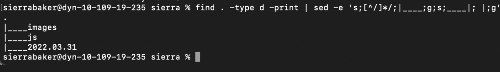

# Project 1

[RETURN TO HOMEPAGE](https://sierrabakerr.github.io/)

## Learning Objectives:

### After completing this project, you will:

Gain experience accessing your operating system's command line interface (CLI)

Gain experience working with CLI commands

Gain experience working with Visual Studio Code (VSCode)

Gain experience writing and executing non-web server Node.js JavaScript code

## Overview:

### Project elements:

Use the command line interface (CLI) of your operating system to create a number of folders

List the folders in a tree-like structure

Use the ping command, and practice using the break keyboard sequence

Create and execute a JavaScript files using Node.js and Visual Studio Code (VSCode) terminal and Run and Debug

## Lab Deliverables:

### 1. p1-folders.png

### 2. p1-tree.png

### 3. p1-break.png

### 6. p1-random.js
[p1-random.js](p1-random.js)

